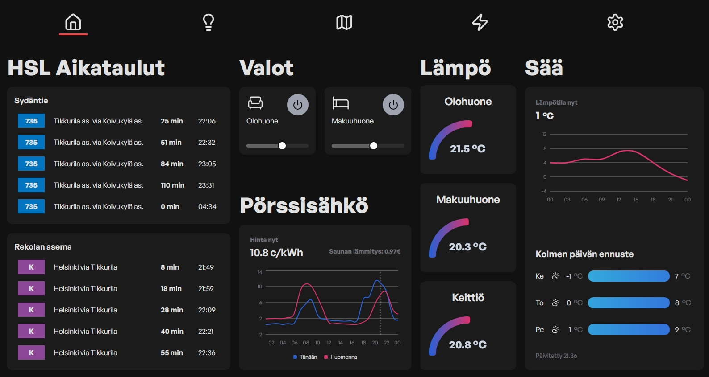

# Smart Home dashboard

## Table of Contents
* [General Info](#general-information)
* [Features](#features)
* [Screenshots](#screenshots)
* [Project Status](#project-status)
<!-- * [License](#license) -->

## General Information
- The aim of this project is to create smart home dasboard to show daily relevant data from bus timetables to energy price
<!-- You don't have to answer all the questions - just the ones relevant to your project. -->

## Features
- HSL timtables 
- Controlling lights
- Energy spot price (+ cost of sauna usage)
- Room temperatures 
- Current weather data
- Weather prediction for 3 days
- Time to work calucations with car and HSL
- Sticky notes for free drawing or writing

## Screenshots

<!-- add img folder to root where readme file is located  -->

## Project Status
Project is:  _work in progress_
 

## Contact
[LinkedIn](https://www.linkedin.com/in/lasse-h%C3%A4m%C3%A4l%C3%A4inen-09b869181/)

<!-- Optional -->
<!-- ## License -->
<!-- This project is open source and available under the [... License](). -->

<!-- You don't have to include all sections - just the one's relevant to your project -->
